# A2SV - G5 Project Phase Developer Readiness Assessment

## Overview

This project is part of the A2SV Developer Readiness Assessment. It involves creating a two-page application showcasing a list of blogs and detailed views of each blog. The application is built using Next.js, React, and Redux Toolkit.

## Features

- **Used Redux for Real-time Search**: Implemented real-time search functionality using Redux for efficient data handling and state management.
- **Client-side Pagination**: Included client-side pagination to manage the display of blog cards effectively.
- **Fully Responsive**: Ensured that the application is fully responsive and compatible with different screen sizes.
- **Fetching and Handling State with RTK**: Utilized Redux Toolkit (RTK) for fetching data and managing application state.
- **Shimmer Loading Effect**: Added a shimmer loading effect to enhance the user experience during data fetching.
- **Includes Sign In and Sign Up Pages**: Implemented secure authentication with Sign In and Sign Up pages integrated with the provided API.

### Screenshots

1. 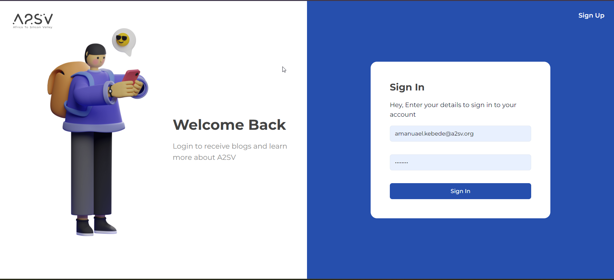
2. 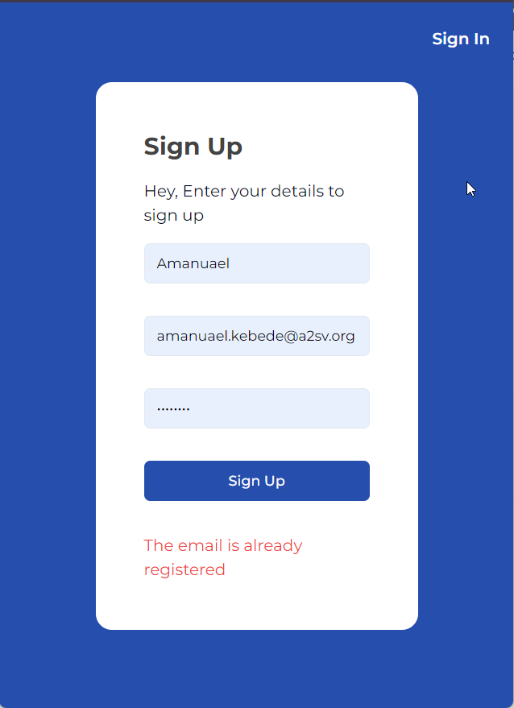
3. 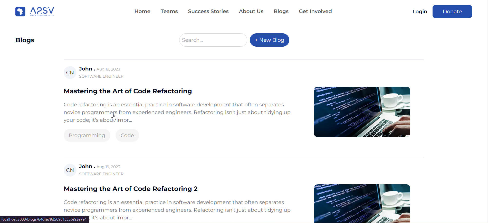
4. 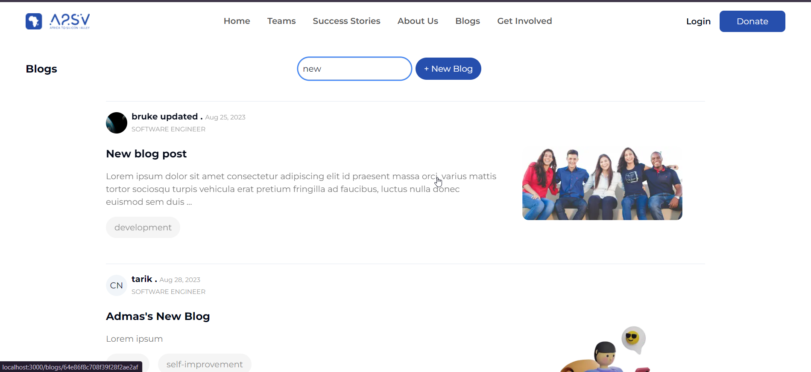
5. 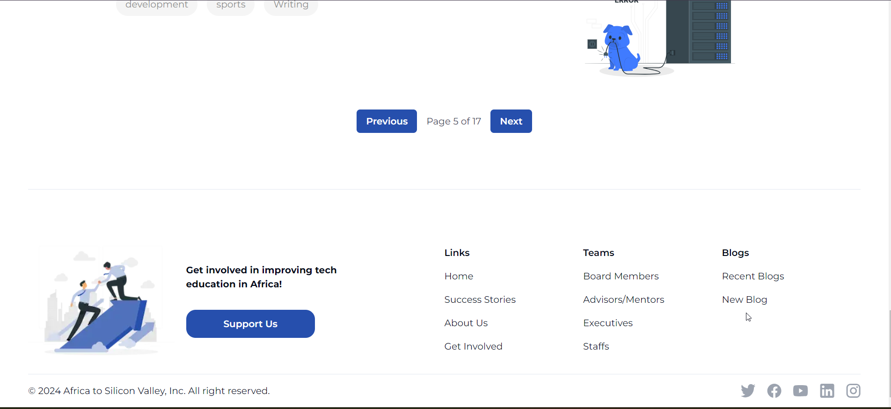
6. 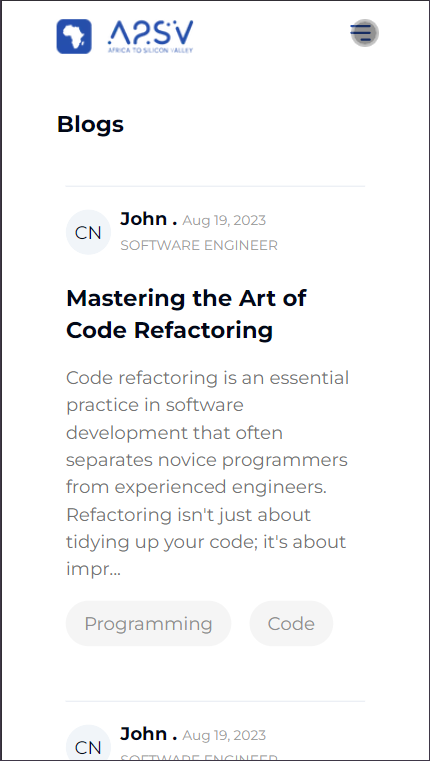
7. 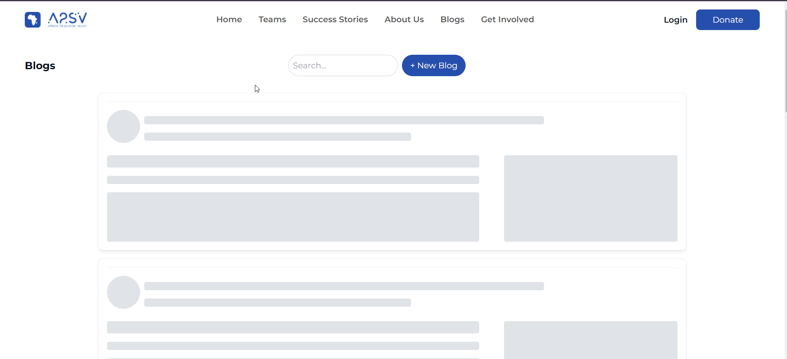
8. 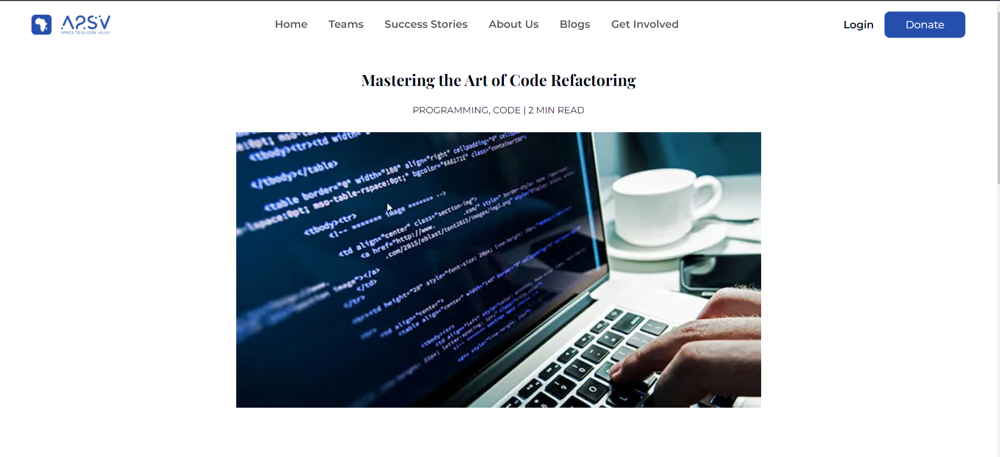
9. 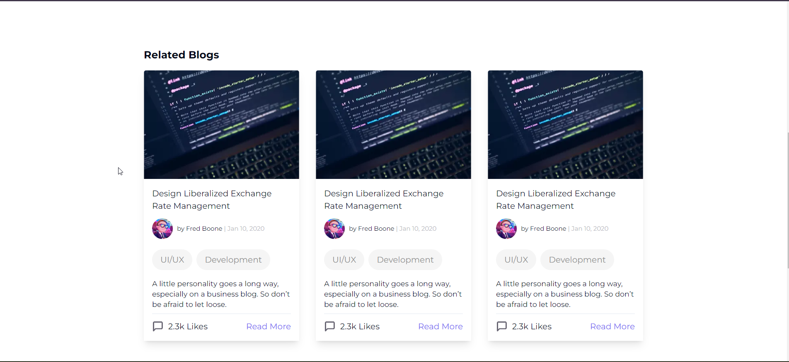
10. 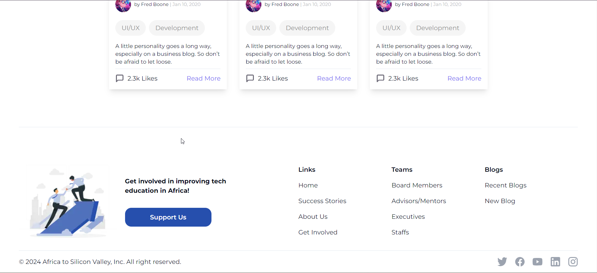
11. 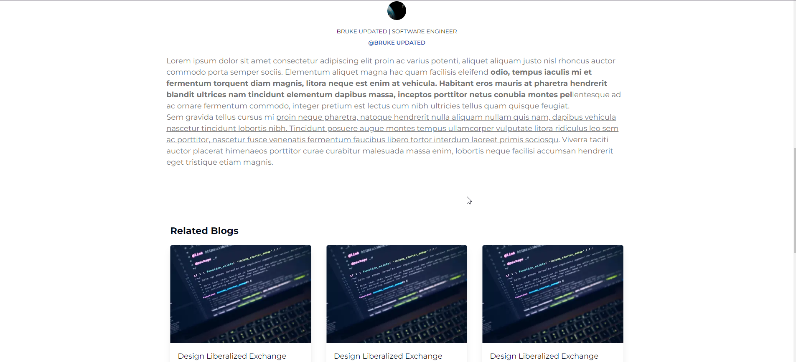
12. 
13. 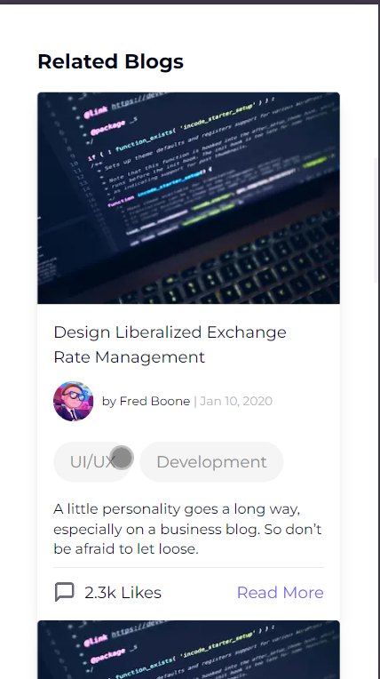

### Page 1: Blog List

- **Display a list of blogs**: Showed a list of blog cards with details as per the Figma design.
- **Search functionality**: Real-time search implemented with Redux.
- **Maximum 5 blog cards**: Displayed up to 5 blog cards on the page.
- **Client-side Pagination**: Managed the display of blog cards with pagination controls.

### Page 2: Blog Detail Page

- **Blog details**: Displayed detailed information of the selected blog.
- **Consistent layout**: Maintained the header and footer design from the blog list page.

### Authentication

- **Sign-Up and Sign-In Pages**: Implemented these pages and integrated them with the provided API for secure authentication.

## Technical Details

### Technologies Used

- **Next.js**: For building the React application with server-side rendering.
- **React Hook Form**: For managing form state and validation.
- **Zod**: For schema validation.
- **Redux Toolkit (RTK)**: For state management and real-time search functionality.
- **Axios**: For making API requests.
- **Tailwind CSS**: For styling.
- **Shimmer Effect**: For a smooth loading experience.

### Data Handling

- **API Endpoint**:
  - Blog Data: `https://a2sv-backend.onrender.com/api/blogs`
  - Authentication: `https://a2sv-backend.onrender.com/api/auth/login`
- **Redux Slices**: Used for managing state related to blogs and authentication.

## Setup

### Prerequisites

- Node.js (version 16 or later)
- npm or yarn

### Installation

1. Clone the repository:
   ```bash
   git clone https://github.com/manuel-heav/G5_web_assessment.git
   ```
2. Navigate to the project directory:
   ```bash
   cd G5_web_assessment
   ```
3. Install the dependencies:
   ```bash
    npm install
   ```
4. Start the development server:
   ```bash
   npm run dev
   ```

### Deployment

    Visit the deployed application [here](https://blog-app-zeta-rosy.vercel.app/)
